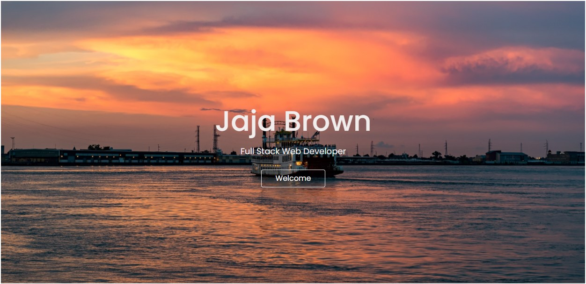

# portfolio

Responsive portfolio page to present projects, contact infromation and future content in my career.

## Built With

- [HTML](https://developer.mozilla.org/en-US/docs/Web/HTML)
- [CSS](https://developer.mozilla.org/en-US/docs/Web/CSS)
- [JavaSCript](https://developer.mozilla.org/en-US/docs/Web/JavaScript)
- [Bootstrap](https://getbootstrap.com/)

## Deployed Link

- [Live site link](https://jbrown827.github.io/portfolio/)

## Site Preview



## Code Snippet

```
<div class="col">

<!-- Card One -->
  <div class="card h-100">
    <imgsrc="./images/planner-screenshot.jpg" class="card-img-top"alt="..."/>
      <div class="card-body">
        <h5 class="card-title">Schedule Planner</h5>
        <p class="card-text">
          A calender application that allows users to save events for
          each hour of the day. The current day is displayed a top the
          screen, as the time blocks are colored coded based on the time
          of day (past,present, or future).
        </p>
        <a href="https://jbrown827.github.io/schedule-planner/" class="btn card-btn" target="_blank">
          Live App
        </a>

```

# Authors

- **Jaja Brown**
  - [Link to Porfolio](https://jbrown827.github.io/portfolio/)
  - [Link to GitHub](https://github.com/jbrown827)
  - [Link to LinkedIn](https://www.linkedin.com/in/jaja-brown-a42261201/)
